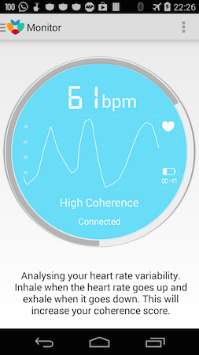

# Description

Anyone can sit down, pace their breathing and think happy thoughts. HeartWave actually tells you when you are doing it right.
HeartWave is a biofeedback app that monitors in real time your heart rate variability in order to assess and control your stress levels.

# How it works

HeartWave works by calculating your coherence score. Coherence is a score ranging from 0 to 100 where 0 represents very low parasympathetic activation (relaxation response) and very high sympathetic activation (stress response) and 100 represents very high parasympathetic activation (relaxation response) and very high sympathetic activation (stress response). 

Your goal is to get a coherence score as big as possible. At any moment the coherence score is represented as a circular progress bar. 
All the possible values are divided in 5 different coherence zones:
- Very Low (red)     	 = [0, 20]
- Low (orange)           = [20, 35]
- Medium Low (green)   	 = [35, 50]
- High (blue)         	 = [50, 65]
- Very High (light blue) = [80 - 100]

The algorithm involved in this computation analyzes all your heart beats and the more the resemble to a clean and big wave the bigger the score is however if your heart beats look disorganized then your coherence score will be low.

# Instructions

To maximize your coherence score (i.e. making your heart rate look like a clean and wide wave) you should sit down, relax and focus in your breathing. Try to inhale through you nose and exhale through your mouth using your diaphragm (inflate your belly while inhaling and deflate your belly while exhaling). When exhaling, really let go any tension and feel how the body sinks more and more.

Pay attention to the graph that displays the heart rate while breathing. You will notice that when you inhale your heart rate goes up and when you exhale your heart rate goes down. Try to create a clean big wave and your coherence score will go up.

# Requirements

It requires a Bluetooth 4.0 heart monitor that measures R-R intervals. It works with heart rate monitors like the Polar H6, Polar H7, Zephyr HxM2 Smart… 

But it does NOT work with: Wahoo BlueHR, Beets BLU, Adidas, Latitude Limited Runtastic TD00290, G.Pulse HR-07, MIO Global, ALPHA 53P, NordicSemiconductor... because these do not measure R-R intervals.

# Benefits

- Learn to relax through breathing. 
- Decrease stress and fatigue.
- Improve performance in stressful situations.
- Get snap out stressful situations.